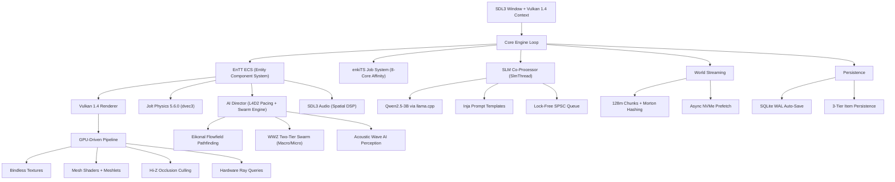
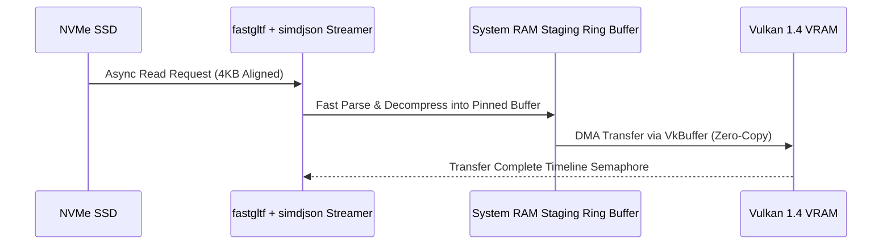

# ZOMBIE ENGINE MASTER REFACTOR PLAN v8.0
## "The Endless Quarantine" — Audited, Deduplicated, Buildable
## Supersedes v7.0 (480 parts → 198 concrete features across 6 stages + 6 platform ports)

---

## AUDIT CHANGELOG (v7.0 & Early Versions → v8.0)

| Change | Detail |
|--------|--------|
| **Deduplication** | 480 parts collapsed to 198 concrete features across Stages 0–5 + 6 platform ports (many were described 2-5x at different detail levels) |
| **Stage Clarification** | Stages renamed to intuitive, plain-English milestones so current progress is instantly understandable |
| **Early Splitscreen (M2.8)** | Local 2-player couch co-op splitscreen moved forward to Stage 3 (Playable Demo) — independent of online netcode |
| **Early Versions Recovery (v8.2)** | Recovered all unique systems from earliest versions (v1–v7, IDEA.md, Master Plan v79, WHY-FANS-LOVE): The Remnant (5th faction), Dual-Axis Fame/Infamy vectors, Nocturnal Runner threat inversion, World-Epoch offline clock, Offscreen fluid horde density, RVT terrain layers, Bernoulli fuel leaks, and ≤50 authored asset cap |
| **Contradiction resolution** | 8 technology contradictions resolved with firm decisions (see §2) |
| **Removed (8 items)** | Custom assembly fibers, custom hash map, custom FixedString, custom SIMD math, GGPO rollback, C++20 modules, quantum networking, "DirectX 13" |
| **Platform ports deferred** | PS5, Xbox, Apple Silicon, Android, Switch ports moved to Tier 6 (post-PC-launch) — all preserved, not deleted |
| **Build ordering** | All features sequenced into 6 dependency-gated tiers |
| **SLM model locked** | Qwen2.5-3B-Instruct (Q4_K_M, ~1.9GB) — supersedes all DeepSeek-R1 1.5B references |

---

## §1 ARCHITECTURE OVERVIEW

### System Architecture



### Thread Concurrency Map (8-Core Affinity)

| Core | Thread | Responsibility | Lock-Free |
|------|--------|---------------|-----------|
| **0** | `MainThread` | SDL3 events, input polling (1000Hz), ImGui | Yes |
| **1** | `RenderThread` | Vulkan command buffer recording | Yes (SPSC) |
| **2** | `AudioThread` | SDL3 audio mixing & spatial DSP | Yes |
| **3** | `SlmThread` | Qwen2.5-3B inference (llama.cpp) | No (compute-bound) |
| **4-7** | `WorkerPool` | enkiTS tasks: physics, ECS, AI, streaming | Yes (work-stealing) |

### Frame Budget (16.6ms / 60 FPS Target)

```mermaid
gantt
    title Frame Execution Budget (16.6ms at 60 FPS)
    dateFormat s
    axisFormat %S.%L
    section Main Thread (Core 0)
    SDL3 Events + Input     : 0, 1ms
    ECS Logic               : 1, 3ms
    Kick Fiber Jobs         : 4, 1ms
    section Render Thread (Core 1)
    Frustum/Occlusion Cull  : 5, 2ms
    Vulkan Cmd Recording    : 7, 4ms
    GPU Submit              : 11, 2ms
    section Audio (Core 2)
    Spatial DSP + HRTF      : 0, 4ms
    section SLM (Core 3)
    Qwen2.5-3B Async Step   : 0, 16ms
    section Workers (Cores 4-7)
    Jolt Physics             : 1, 3ms
    Flowfield AI             : 3, 2ms
    World Streaming          : 6, 2ms
```



### Zero-Copy Asset Streaming Pipeline



---

## §2 RESOLVED TECHNOLOGY DECISIONS

These are **final**. All contradicting references in v7.0 and spec/ files are superseded.

| # | Decision | **Locked To** | Supersedes |
|---|----------|--------------|------------|
| 1 | **Scripting** | No Lua/Luau. C++ `std::function` hooks + JSON manifests | v7.0 Parts 1-6 (Lua APIs), Part 130.4 (Luau scripting) |
| 2 | **Prompt templates** | Inja C++ (header-only, zero-alloc) | v7.0 Part 3 (Jinja2) |
| 3 | **Cell size** | 128m x 128m WorldPartition grid | v7.0 Part 1.1 (64m) |
| 4 | **TTS engine** | Kokoro-82M ONNX Runtime (CPU) | v7.0 Part 6 additions (Piper TTS) |
| 5 | **SLM model** | Qwen2.5-3B-Instruct (Q4_K_M GGUF, ~1.9GB) | v7.0 metadata (DeepSeek-R1 1.5B, 700MB) |
| 6 | **Netcode model** | Client-server with host authority + FlatBuffers | v7.0 Part 9.3 (GGPO rollback) |
| 7 | **VMA version** | 3.4.0 (current in vcpkg.json) | v7.0 Part 131.4 (references 3.2) |
| 8 | **ECS** | Use EnTT sparse-set as-is | v7.0 Parts 133.1/134.1/467 (custom archetype ECS) |

---

## §3 HARDWARE TARGETS & VRAM BUDGET

### Minimum Floor (1080p @ 30 FPS Lock)
- **GPU:** RTX 2060 6GB / RX 6600 8GB / Arc A580 8GB
- **CPU:** Ryzen 5 3600 / Core i5-10400 (6C/12T)
- **RAM:** 16 GB DDR4
- **Mandatory:** Hardware RT support (GTX-series excluded)

### Recommended (1440p @ 60 FPS Lock)
- **GPU:** RTX 2070 Super 8GB / RX 6700 XT 8GB / Arc A770 16GB
- **CPU:** Ryzen 7 5700X / Core i7-11700K (8C/16T)
- **RAM:** 16-32 GB DDR4/DDR5

### VRAM Allocation (Dual Hardware Target Budget)

| Budget Slice | 6GB Floor (RTX 2060 / 1080p @ 30) | 8GB Recommended (RTX 2070S / 1440p @ 60) |
|---|---|---|
| Mip-Streamed BC7/BC5 Textures | 1.8 GB | 2.5 GB |
| SLM Co-Processor (Qwen2.5-3B Q4_K_M) | 1.8 GB | 1.9 GB |
| Render Targets & G-Buffers | 0.6 GB (1080p Dynamic) | 0.8 GB (1440p Native) |
| Geometry & Vertex Buffers | 0.5 GB | 0.7 GB |
| Jolt Physics + Audio Buffers | 0.3 GB | 0.3 GB |
| **TOTAL GAME BUDGET** | **5.0 GB (Hard Cap)** | **6.2 GB (Hard Cap)** |
| **Reserved OS / Display Overhead** | **1.0 GB** | **1.8 GB** |

### System RAM Budget (16 GB Total)

| Budget Slice | RAM |
|-------------|-----|
| Windows OS Overhead | 4.0 GB |
| Asset Streaming & VFS Ring Cache | 4.0 GB |
| Game State & ECS | 3.5 GB |
| Jolt Physics (dvec3) | 1.5 GB |
| enkiTS Task Scheduler | 1.0 GB |
| Audio DSP & Buffers | 1.0 GB |
| SLM KV-Cache & Prompts | 1.0 GB |

---

## §4 MASTER DEPENDENCY MANIFEST (vcpkg.json)

> **Rule: Do not add new dependencies until the tier that needs them.**

| Package | Version | Purpose | Tier |
|---------|---------|---------|------|
| `sdl3` (vulkan) | 3.4.12+ | Windowing, input, audio | 0 ✅ |
| `volk` | 1.4.350+ | Vulkan function loader | 0 ✅ |
| `vk-bootstrap` | 1.4.350+ | Device selection | 0 ✅ |
| `vulkan-memory-allocator` | 3.4.0 | GPU memory management | 0 ✅ |
| `spirv-reflect` | 1.4.350+ | Shader reflection | 0 ✅ |
| `shaderc` | 2026.2+ | Runtime GLSL to SPIR-V | 0 ✅ |
| `spdlog` | 1.17.0 | Async logging | 0 ✅ |
| `tracy` | 0.13.1 | Frame profiling | 0 ✅ |
| `imgui` (freetype, sdl3, vulkan) | 1.92.8 | Debug UI | 0 ✅ |
| `glm` | 1.0.3 | Math (GLM_FORCE_AVX2) | 0 ✅ |
| `nlohmann-json` | 3.12.0 | Config/data files | 0 ✅ |
| `cxxopts` | 3.3.1 | CLI parsing | 0 ✅ |
| `stb` | 2024+ | Image loading | 0 ✅ |
| `msdfgen` | 1.13 | SDF text rendering | 0 ✅ |
| `enkits` | 1.12 | Job scheduling | 0 ✅ |
| `fastgltf` | 0.9.0 | glTF mesh loading | 1 ✅ |
| `entt` | 3.16.0 | Entity component system | 2 ✅ |
| `joltphysics` (double, deterministic) | 5.6.0 | Physics simulation | 2 ✅ |
| `catch2` | 3.15.2 | Unit testing | 2 ✅ |
| *Future:* `sqlite3` | — | Save persistence | 3 |
| *Future:* `flatbuffers` | — | Network serialization | 5 |
| *Future:* `inja` | — | Prompt templates | 5 |

---

## §5 ROADMAP — 6 PRACTICAL STAGES (198 UNIQUE FEATURES + 6 PLATFORM PORTS)

> Every unique feature from v7.0 appears below. Nothing is deleted — only deduplicated,
> sequenced by dependency, and assigned a stage. Each stage has a **gate criterion** that
> must pass before the next stage begins.

### Roadmap At A Glance

| Stage | Milestone Alignment | Plain English | Gate Criterion | Status |
|---|---|---|---|---|
| **Stage 0** | Tier 0 (M0/M1 Infra) | **Engine Boot** | Starts cleanly on discrete GPU with 0 errors | ✅ **Done** |
| **Stage 1** | Tier 1 (M2 Core Render) | **3D Model & Lights** | 3D zombie model visible with shadows & lighting | 🎯 **Current Focus** |
| **Stage 2** | Tier 2 (M1/M2/M5 Basics) | **Walking & Shooting** | Shoot a walking zombie; it falls down with ragdoll | Next |
| **Stage 3** | Tier 3 (M3/M4/M5/M7/M8 + M2.8) | **Playable Demo & Local Splitscreen** | 10-min survival run (loot, hordes, save/load, 2P splitscreen) | Future |
| **Stage 4** | Tier 4 (M10/M11/M2.9) | **AAA Graphics & Polish** | Rain, fog, Ray Tracing, and DLSS/FSR upscaling | Future |
| **Stage 5** | Tier 5 (M8.6/M9/M12/M13) | **Full Campaign & Online Co-op** | Driving cars, base building, 4P online co-op, AI chat | Future |
| **Stage 6** | Tier 6 (Consoles) | **Console Ports** | Port to PS5 Pro, Xbox Series X, Switch 2, Steam Deck | Post-PC |

---

### STAGE 0 (TIER 0): ENGINE BOOT — Completed ✅
**Plain English:** The engine starts up, initializes Vulkan 1.4 & hardware, and shuts down with 0 errors.
**Gate:** `HEADLESS_BOOT_OK` with clean Vulkan validation layers

| # | Feature | Status |
|---|---------|--------|
| T0-01 | SDL3 window + Vulkan 1.4 instance/device | ✅ Done |
| T0-02 | vk-bootstrap physical device selection (discrete GPU, RT required) | ✅ Done |
| T0-03 | VMA 3.4.0 allocator (no raw vkAllocateMemory) | ✅ Done |
| T0-04 | Dynamic rendering (VK_KHR_dynamic_rendering) | ✅ Done |
| T0-05 | Synchronization2 barriers (VK_KHR_synchronization2) | ✅ Done |
| T0-06 | Timeline semaphores (VK_KHR_timeline_semaphore) | ✅ Done |
| T0-07 | Buffer device address (VK_KHR_buffer_device_address) | ✅ Done |
| T0-08 | Pipeline cache persistence (pipeline_cache.bin) | ✅ Done |
| T0-09 | spdlog async ring buffer + Tracy profiler | ✅ Done |
| T0-10 | Crashpad / SEH minidump handler | ✅ Done |
| T0-11 | ImGui Vulkan debug overlay | ✅ Done |
| T0-12 | MSDF text rendering pipeline | ✅ Done |
| T0-13 | enkiTS job system + thread affinity | ✅ Done |
| T0-14 | GLSL to SPIR-V shader compilation (shaderc) | ✅ Done |
| T0-15 | Frame deletion queue (N-buffered resource cleanup) | ✅ Done |
| T0-16 | CVar system | ✅ Done |
| T0-17 | Input system (keyboard + mouse + gamepad via SDL3) | ✅ Done |
| T0-18 | Headless CI smoke test | ✅ Done |
| T0-19 | Pipeline builder + compatibility validator | ✅ Done |
| T0-20 | Swapchain management (mailbox / FIFO present modes) | ✅ Done |

---

### STAGE 1 (TIER 1): 3D MODEL & LIGHTS ← CURRENT PRIORITY 🎯
**Plain English:** You can see a textured 3D zombie in the scene with real lighting and shadows.
**Gate:** Load a glTF zombie model, PBR-shade it with directional light, shadows on screen

| # | Feature | Description | Deps |
|---|---------|-------------|------|
| T1-01 | **glTF mesh loading** | fastgltf parses .glb/.gltf, vertex/index data uploaded to VMA buffers | T0 |
| T1-02 | **Persistent mapped staging ring buffer** | CPU-visible VMA ring for async uploads to GPU-local memory | T0-03 |
| T1-03 | **PBR metallic-roughness shader** | Standard PBR: albedo, normal, metallic-roughness, AO maps | T1-01 |
| T1-04 | **Bindless texture array** | VK_EXT_descriptor_indexing, partially-bound, 500K handle capacity | T1-03 |
| T1-05 | **BC7/BC5 texture compression** | BC7 for albedo/metallic, BC5 for normals. Pre-computed mip chains | T1-04 |
| T1-06 | **Directional + point lighting** | Forward+ or deferred. One cascaded shadow + N point lights | T1-03 |
| T1-07 | **Cascaded shadow mapping** | 4-cascade CSM with PCF soft shadows | T1-06 |
| T1-08 | **Hi-Z two-pass occlusion culling** | Depth pyramid then visibility test. Budget: < 0.1ms | T1-07 |
| T1-09 | **GPU-driven multi-draw indirect** | Single vkCmdDrawIndexedIndirect for entire visible scene | T1-08 |
| T1-10 | **Render graph resource management** | Automatic transient attachment allocation, aliasing | T1-09 |
| T1-11 | **SPIRV-Reflect auto shader bindings** | Auto-generate descriptor layouts from SPIR-V bytecode | T1-03 |
| T1-12 | **Camera system** | Debug fly cam + game camera with head inertia (spring-damper) | T1-01 |
| T1-13 | **Compute histogram eye adaptation** | Human iris dilation simulation for dark/bright transitions | T1-10 |
| T1-14 | **Pipeline warmup** | Pre-compile all shader permutations at boot. Zero in-game stutter | T1-11 |
| T1-15 | **VRAM memory budget guard** | Track VMA budget, shed mip levels at 6.2GB ceiling | T0-03 |
| T1-16 | **Scalar block layout** | VK_EXT_scalar_block_layout for 1:1 CPU/GPU struct matching | T0 |
| T1-17 | **Shader hot-reload** | ReadDirectoryChangesW watcher, async SPIR-V recompile, live VkPipeline swap without restart | T0-14 |
| T1-18 | **Packed ARM texture layout** | AO+Roughness+Metallic in single RGB texture, 60% fewer material bindings | T1-03 |
| T1-19 | **Compute GPU skeletal skinning** | Skin once per frame in compute, share output buffer across all passes (shadow, depth, color) | T1-01, T1-04 |
| T1-20 | **Parallel secondary command buffers** | Worker threads record VkCommandBuffer secondaries in parallel, concat into single primary | T0-13 |
| T1-21 | **DAG async asset loader** | Directed acyclic graph dependency resolver, parallel texture+mesh+audio streaming across all cores | T0-13 |
| T1-22 | **sccache compiler caching** | 90% faster incremental rebuilds via compiled object caching | T0 |
| T1-23 | **VMA defragmentation telemetry** | Real-time VRAM fragmentation ratio, auto vmaDefragmentationPass at >15% | T0-03, T1-15 |

---

### STAGE 2 (TIER 2): WALKING & SHOOTING
**Plain English:** Move your character, aim your gun, watch the zombie walk towards you, shoot it, and watch it ragdoll onto the ground.
**Gate:** Zombie entity spawns with physics, walks via flowfield AI, can be shot and ragdolls

| # | Feature | Description | Deps |
|---|---------|-------------|------|
| T2-01 | **EnTT ECS integration** | Registry, views, component iteration for all game entities | T1 |
| T2-02 | **Jolt Physics 5.6.0** | Double-precision origin, character controllers, raycasts | T1 |
| T2-03 | **Floating origin shift (dvec3)** | Re-center world origin to prevent jitter at >50km distances | T2-02 |
| T2-04 | **Core game loop** | Spawn, Update(dt), Physics step, Render. Fixed timestep | T2-01, T2-02 |
| T2-05 | **EventBus (zero-alloc ring)** | Compile-time type-indexed, SPSC/MPMC atomic queues | T2-04 |
| T2-06 | **Zombie FSM** | Idle, Wander, Alert, Chase, Attack, Stumble, Ragdoll | T2-04 |
| T2-07 | **Eikonal flowfield pathfinding** | Density-cost wavefront. 500+ zombies without A* collapse | T2-06 |
| T2-08 | **Morton 64-bit spatial hashing** | O(1) spatial queries, cache-friendly contiguous memory | T2-07 |
| T2-09 | **Skeletal animation** | Runtime skeletal evaluation, blend trees | T1-01 |
| T2-10 | **Two-bone analytical foot IK** | Feet align to terrain slopes, stairs, rocks via Jolt raycasts | T2-09 |
| T2-11 | **Procedural weapon animation** | Weapon mass inertia, compressed high-ready, barrel lag | T2-09 |
| T2-12 | **SDL3 audio engine** | Basic spatial audio, HRTF, distance attenuation | T2-04 |
| T2-13 | **Acoustic wave propagation** | Speed-of-sound delay (343 m/s), ring-buffered acoustic queue | T2-12 |
| T2-14 | **Data-driven JSON configs** | Weapon stats, AI params, director coefficients in JSON files | T2-04 |
| T2-15 | **Linear/bump arena allocators** | Per-frame TransientArena, TLSF for long-lived objects | T2-04 |
| T2-16 | **Deterministic PRNG** | Seeded RNG for reproducible gameplay | T2-04 |
| T2-17 | **Entity factory + generational table** | Stable IDs, pooled creation/destruction | T2-01 |
| T2-18 | **Async physics interpolation** | Smooth rigidbody rendering between fixed physics ticks at any monitor refresh rate | T2-02, T2-04 |
| T2-19 | **ECS prefab variant inheritance** | Hierarchical prefab templates: modify base "Zombie" → cascades to "Armored Zombie" with overrides | T2-01 |
| T2-20 | **C++20 coroutine task scheduler** | std::coroutine for clean async asset loading, network RPCs without callback hell | T2-04 |
| T2-21 | **Cache-line false-sharing prevention** | alignas(std::hardware_destructive_interference_size) on all atomic/cross-thread data | T2-04 |
| T2-22 | **Material acoustic absorption coefficients** | Per-material dB loss (Concrete -30dB, Wood -8dB, Glass -3dB) for sound propagation | T2-12 |
| T2-23 | **Parent-child transform hierarchy (M1-EXT-41)** | EnTT parent/child entity relationships, local-to-world matrix propagation, socket attachment for weapon mods/gear | T2-01 |
| T2-24 | **First-person traversal & parkour (M2.9)** | Contextual obstacle vaulting, ledge mantling, physical ladder climbing, sprint-sliding with Jolt shape height adjust | T2-02, T2-04 |

---

### STAGE 3 (TIER 3): PLAYABLE DEMO & LOCAL SPLITSCREEN
**Plain English:** A real 10-minute game you can play alone or 2-player couch co-op on one screen: loot buildings, survive 500-zombie hordes, and save your progress.
**Gate:** Playable 10-minute demo. Explore, fight hordes, find loot, save and load, optional 2-player local splitscreen (M2.8)

| # | Feature | Description | Deps |
|---|---------|-------------|------|
| T3-01 | **L4D2 AI Director** | Stress-curve pacing: BuildUp, SustainPeak, PeakFade, Relax | T2-06, T2-07 |
| T3-02 | **WWZ two-tier swarm engine** | Tier A: macro flockers (VAT GPU skinning). Tier B: micro combat actors (full skeleton, ragdoll). Promote within 6m | T3-01 |
| T3-03 | **VAT GPU-skinned macro zombies** | Baked animation textures, 1000+ instances via vertex shader lookup | T3-02 |
| T3-04 | **6DOF bullet drag ballistics** | Cd=0.295, gravity drop, wind drift. 100% real-time, no time-slow | T2-02, T2-11 |
| T3-05 | **Meshlet dismemberment** | Pre-split skeletal meshlet clusters, baked stub caps, compute buffer visibility toggling | T3-04 |
| T3-06 | **Acoustic AI hearing + light perception** | Ray-traced acoustic reflection through corridors. Compute light-level vision | T2-13, T2-06 |
| T3-07 | **Bodycam first-person camera** | Eye-level 1.68m, head/neck spring-damper inertia, kinetic footfall impacts | T1-12 |
| T3-08 | **Soft proportional free-aim** | 75% gun / 25% camera inside +/-12 deg deadzone | T3-07 |
| T3-09 | **Physical magazine inspection** | Multi-stage: DropToPalm, InspectWitnessHoles, Reseat | T2-11 |
| T3-10 | **Bethesda 3-tier item persistence** | Eternal (weapons) / Clutter LRU (256/chunk) / Ephemeral (brass, blood) | T2-01 |
| T3-11 | **Kinematic sleep-on-load** | Items init as kinematic, 3-frame soft contact relaxation (v_max = 1.5 m/s) | T3-10, T2-02 |
| T3-12 | **SQLite WAL auto-save** | Background thread, LZ4 compressed, schema auto-migration | T3-10 |
| T3-13 | **World streaming (128m chunks)** | Async load/unload, velocity-based prefetch, NVMe ring buffer | T2-08 |
| T3-14 | **Heightmap terrain** | .r16 raw float + BC5 compressed normals, GPU-direct streaming | T3-13 |
| T3-15 | **Leveled list loot system** | Fallout 4-compatible algorithm with keyword filters | T2-14 |
| T3-16 | **Weight/volume encumbrance** | Physical kg, container slots (vest, backpack, pockets) | T3-15 |
| T3-17 | **Survival systems** | Stamina, body temperature, infection status | T2-04 |
| T3-18 | **GPU compute particles** | 50K particles, async compute queue, prefix-scan compaction | T1-10 |
| T3-19 | **NPC response system** | Criteria-based barks: speaker != PLAYER, cooldown, health tier | T2-06, T2-12 |
| T3-20 | **Gamepad radial command wheel** | LB hold, 6 tactical orders (Hold, Breach, Barricade, Focus, Scavenge, Fallback) | T2-04 |
| T3-21 | **Mod system (C++ hooks + JSON)** | std::function registries, mod.json manifests, semver, load order | T2-14 |
| T3-22 | **Silent protagonist** | Player is non-verbal. Only biological sounds. All spoken callouts from NPCs only | T3-19 |
| T3-23 | **Physics grab and arrange** | 6-DOF spring-damper constraint for lifting/rotating items | T2-02 |
| T3-24 | **Supersonic ballistic acoustics** | Mach cone shockwave, crack/muzzle separation, subsonic whiz-bys | T3-04, T2-12 |
| T3-25 | **Surface-dependent brass impacts** | Concrete/wood/metal/carpet resonant filter profiles | T2-12 |
| T3-26 | **Kinetic gear rattle** | Plate carrier / Molle clatter driven by acceleration and angular jerk | T3-07 |
| T3-27 | **Weapon jamming and fouling** | Barrel heat, carbon fouling, magazine spring tension. FTF/FTE jams require manual clearing | T3-04 |
| T3-28 | **Heart rate and lungs stamina** | Physical BPM (60-180), O2 deficit, breath gasping audio, weapon sway tied to recovery time | T3-17 |
| T3-29 | **Compute stealth illuminance** | Dynamic screen-space lux compute integrator. Smooth 0-100 stealth visibility meter | T2-06, T1-06 |
| T3-30 | **RVO2 companion collision avoidance** | Reciprocal velocity obstacles + contextual doorway yielding to prevent blocking | T2-06 |
| T3-31 | **Dynamic Recast navmesh carving** | Player barricades/explosions carve 128x128 navmesh tiles in <1ms, auto off-mesh vault links | T2-07 |
| T3-32 | **Weapon sway fatigue and adrenaline** | ADS accumulates lactic acid fatigue increasing sway. Damage spikes adrenaline micro-tremor | T2-11, T3-28 |
| T3-33 | **Center-of-mass encumbrance shift** | Heavy backpack shifts 3D CoM, causing momentum drift in turns and stamina drain crouching | T3-16 |
| T3-34 | **Dynamic wildlife AI** | Deer, wolves, birds with graze/hunt/scatter behaviors reacting to gunfire and hordes | T2-06, T3-13 |
| T3-35 | **Faction territorial Voronoi** | Dynamic 2D Voronoi grid, faction pressure causes organic border skirmishes and raids | T3-12, T2-14 |
| T3-36 | **Voronoi glass window shatter** | Impact-point-centered Voronoi fracture, physical glass shard projectiles | T2-02, T3-05 |
| T3-37 | **Ragdoll momentum blend-back** | Evaluate bone velocities on recovery, context-sensitive get-up locomotion matching momentum | T2-09, T2-02 |
| T3-38 | **NPC cognitive load and decision latency** | Stress increases reaction time: green bandits hesitate, veteran soldiers react instantly | T2-06 |
| T3-39 | **Blood clotting and coagulation** | Dynamic viscosity, gravity runoff, temporal coagulation turning arterial spray to dark pools | T3-05 |
| T3-40 | **Local splitscreen co-op (M2.8)** | Dual/quad viewport division (VkViewport/VkRect2D), multi-gamepad assignment, dual cameras, split spatial audio | T1-12, T2-04 |
| T3-41 | **Web-based perk & progression system (M8.7)** | Non-linear skill web (Combat, Survival, Scavenging, Leadership), EventBus PerkPoints via survival milestones/factions | T2-05, T2-14 |
| T3-42 | **Seamless interior cell streaming (M2.6)** | Portal-based occlusion & streaming transitions between exterior world chunks and building interiors with zero load screens | T3-13 |
| T3-43 | **Diegetic wristwatch & survival compass (M10-EXT-24, M11-EXT-63)** | Physical wrist inspection showing analog time, dusk siren alarm trigger, radiation Geiger meter, and compass needle | T3-07, T1-12 |
| T3-44 | **Dual-axis faction reputation (Fame/Infamy) & The Remnant (M8-EXT-53, Decision 2)** | Independent {Fame, Infamy} vectors per faction (Raiders, Militia, Cultists, Nomads, The Remnant military). Shopkeeper trade pricing and guard hostility derive from cross-faction bias matrix | T3-35, T2-14 |
| T3-45 | **Nocturnal runner shift & day/night danger inversion (M5, M10)** | Daytime zombies are sluggish shamblers; at sundown (lux < threshold), infected undergo metabolic shift into sprint runners (speed 3x, detection 3x, double loot) | T3-01, T3-17 |
| T3-46 | **World-epoch offline fast-forward clock (M0-EXT-21)** | Stores real-world wall clock at save. On reload, offline elapsed time simulates crop growth/decay, food spoilage, barricade weathering fatigue, and faction shifts | T3-10, T3-12 |
| T3-47 | **Offscreen continuum-fluid macro-horde simulation (M5.4-EXT-08)** | Simulates thousands of offscreen zombies as a 2D continuum-fluid density field through corridors; discretizes into 3D kinematic/ragdoll actors within chunk streaming radius | T3-02, T3-13 |
| T3-48 | **Deterministic input replay & spectator ghost (M2.8-EXT-09)** | Circular ring buffer recording inputs, RNG seeds, and tick state hashes for instant replay, killcams, anti-cheat desync validation, and ghost playback (<1% pose error) | T2-07, T0-17 |

---

### STAGE 4 (TIER 4): AAA GRAPHICS & POLISH
**Plain English:** Blockbuster visuals: rainstorms, reflective puddles, thick volumetric fog, ray-traced lighting, and DLSS/FSR upscaling.
**Gate:** Visually competitive. Weather, volumetrics, ray tracing, upscaling all functional

| # | Feature | Description | Deps |
|---|---------|-------------|------|
| T4-01 | **Mesh shaders + meshlet pipeline** | VK_EXT_mesh_shader. Task shader GPU frustum/occlusion cull | T1-09 |
| T4-02 | **Meshoptimizer cluster optimization** | Optimal meshlet generation (64 verts, 124 triangles) | T4-01 |
| T4-03 | **Variable rate shading (VRS Tier 2)** | 2x2/4x4 for background/fast-moving pixels. 30% GPU savings | T4-01 |
| T4-04 | **Hardware ray queries** | RT shadows + RTAO via VK_KHR_ray_query in compute/fragment | T4-01 |
| T4-05 | **DLSS 4.5 / FSR 4 / DirectSR** | NVIDIA Streamline + DirectSR meta-API. Frame generation | T4-06 |
| T4-06 | **Motion vector export** | 32-bit motion vectors + depth + reactive masks to render targets | T1-10 |
| T4-07 | **NVIDIA Reflex 2.0 / AMD Anti-Lag 2** | Latency markers in swapchain presentation | T0-20 |
| T4-08 | **Volumetric 3D froxel atmosphere** | Fog/dust/rain density varies by altitude, humidity, enclosures | T4-04 |
| T4-09 | **Weather system** | Rain, fog, Mie phase scattering, dynamic cloud cover | T4-08 |
| T4-10 | **Puddle accumulation** | Heightmap accumulation buffer, roughness to 0.001, albedo darken 30%, SSR activate | T4-09 |
| T4-11 | **Dynamic time-of-day** | Sun/moon cycle, atmospheric scattering, auto-exposure | T1-06, T1-13 |
| T4-12 | **GPU-driven vector HUD** | Single GPU pass, crisp at 4K, zero CPU draw call overhead | T1-10 |
| T4-13 | **Diegetic 3D UI projection** | Holographic / helmet visor UI elements in world space | T4-12 |
| T4-14 | **FFT formant lip-sync** | Real-time viseme morph weights from audio FFT | T2-09, T2-12 |
| T4-15 | **Threat-aware frequency ducking** | Duck 300Hz-3.4kHz during radio barks | T2-12 |
| T4-16 | **Descriptor buffers** | VK_EXT_descriptor_buffer replacing descriptor pools | T1-04 |
| T4-17 | **Shader objects** | VK_EXT_shader_object eliminating VkPipeline overhead | T1-14 |
| T4-18 | **Conservative rasterization** | VK_EXT_conservative_rasterization for voxelization / LOS checks | T4-04 |
| T4-19 | **Async compute queues** | AI pathfinding + particle physics on VK_QUEUE_COMPUTE_BIT | T3-18 |
| T4-20 | **Asset cooking (.zepak)** | Binary pack format, magic 0x5A45504B, zero-copy DMA from NVMe | T3-13 |
| T4-21 | **Dynamic extended state 3** | VK_EXT_extended_dynamic_state3 for runtime rasterizer changes | T0-19 |
| T4-22 | **Opacity micromaps** | VK_EXT_opacity_micromap for RT perf on alpha-tested meshes | T4-04 |
| T4-23 | **RT diffuse global illumination** | VK_KHR_ray_query multi-bounce diffuse GI, flashlights bounce off colored walls | T4-04 |
| T4-24 | **Subsurface scattering skin shader** | Separable SSSS for realistic human skin translucency on ears, noses, hands | T1-03 |
| T4-25 | **FFT ocean and river water** | GPU FFT wave simulation, optical depth absorption, dynamic shoreline foam | T3-18 |
| T4-26 | **3D ray-marched volumetric clouds** | Physical cloud formations reacting to wind/humidity/sun with Mie scattering | T4-08 |
| T4-27 | **Atmosphere multi-scattering LUTs** | GPU precomputed 4D atmospheric LUTs for photorealistic sunsets and twilight | T4-11 |
| T4-28 | **SMAA 1x compute fallback** | Razor-sharp spatial AA alternative for players who dislike TAA blur | T1-10 |
| T4-29 | **Clustered forward transparency** | Glass/ice/smoke forward-rendered using 3D clustered light grid after deferred pass | T1-06 |
| T4-30 | **Clustered deferred decals** | Z-binning tiled decal projection, no early-Z breakage | T1-10 |
| T4-31 | **GPU foliage bending and tread flattening** | Characters/vehicles push bending vectors into 2D deformation texture | T3-13, T1-10 |
| T4-32 | **Height-based POM terrain blending** | Parallax occlusion mapping with per-texture heightmaps for sharp material edges | T3-14 |
| T4-33 | **Persistent blood/gore accumulation map** | 4K dynamic texture array, permanent blood/drag trails, no memory leak | T3-05 |
| T4-34 | **GPU XPBD cloth and rope simulation** | Clothing capes, cables, tarps react to movement, wind, body collision on compute | T2-09, T3-18 |
| T4-35 | **Helmet visor optics shader** | Internal breath fogging, external rain droplets, glass scratches, hand-wipe clearing | T3-07, T4-09 |
| T4-36 | **Infrared thermal and NVG optics** | Physical body temp (37C human, 90C engine), emissivity maps, phosphor tube noise | T1-06 |
| T4-37 | **Weapon carbon/rust wear shaders** | GPU procedural carbon residue, metal scratches, mud accumulation based on use | T3-27 |
| T4-38 | **Atmospheric dust and spore particles** | 3D micro-particle volume emitters illuminated by flashlight shafts in dark spaces | T3-18, T4-08 |
| T4-39 | **Retroreflection shader** | Micro-facet retroreflection BRDF for road signs, safety vests, cat-eye markers | T1-03 |
| T4-40 | **Emissive surface voxel bounce light** | Voxelize high-intensity emissive triangles into GI structure for neon illumination | T4-23 |
| T4-41 | **Wind occlusion for vegetation** | 3D wind occlusion compute shader: indoor plants and sheltered trees stay still | T4-09, T3-13 |
| T4-42 | **Foliage motion vectors for DLSS/FSR** | Per-leaf procedural velocity generation eliminating upscaler ghosting on vegetation | T4-05, T4-31 |
| T4-43 | **RT acceleration structure compaction** | Dynamic BVH compaction after build passes, reclaim 50% RT VRAM | T4-04 |
| T4-44 | **Spatiotemporal path tracing denoiser** | SVGF + AI denoiser for clean 1-spp path traced images | T4-23 |
| T4-45 | **Planar & stochastic ray-marched water reflections (Part 451)** | Hi-Z screen-space reflections (SSR) with ray query fallback for reflective puddles and wet streets | T4-25, T4-04 |
| T4-46 | **Runtime virtual texturing (RVT) for terrain & dynamic stains (M4.5, Part 452)** | GPU-cached virtual texture system baking multi-layer terrain blends, muddy vehicle tire tracks, footprint impressions, and blood spatters directly into terrain tiles without individual quad draw overhead | T3-14, T4-10 |

---

### STAGE 5 (TIER 5): FULL CAMPAIGN & ONLINE CO-OP
**Plain English:** Full open-world features: drive physical cars, build safehouses with electric wiring, 4-player online co-op with friends, and AI survivor chatter.
**Gate:** Feature-complete for Early Access or vertical slice

| # | Feature | Description | Deps |
|---|---------|-------------|------|
| T5-01 | **Co-op netcode** | Client-server, host authority, input prediction, state rewind | Full T3 |
| T5-02 | **FlatBuffers serialization** | Zero-copy binary network packets | T5-01 |
| T5-03 | **Half-float delta compression** | 16-bit quantized positions, bitmask dirty flags. 70% bandwidth reduction | T5-01 |
| T5-04 | **Sub-tick input rewind** | Rewinding physics/state for lag compensation | T5-01, T2-02 |
| T5-05 | **Epic Online Services (EOS)** | Free P2P lobbies, NAT punch-through, voice chat | T5-01 |
| T5-06 | **Union frustum BVH sharing** | Co-op players share culling results to reduce GPU work | T5-01, T1-08 |
| T5-07 | **SLM integration** | Qwen2.5-3B on SlmThread via llama.cpp. SPSC input/output queues | T2-04 |
| T5-08 | **Inja prompt templates + hot-reload** | ReadDirectoryChangesW file watcher, hash-based cache invalidation | T5-07 |
| T5-09 | **20 SLM EXT subsystems** | Mission bounty, forensic autopsy, faction radio, companion barks, terminal logs, etc. | T5-07 |
| T5-10 | **Kokoro-82M TTS** | CPU ONNX inference, 50x realtime, dual-path (recording override) | T5-07, T2-12 |
| T5-11 | **SLM KV-cache management** | PagedAttention, VRAM/RAM offload during combat, 1.9GB budget | T5-07 |
| T5-12 | **Vehicle physics** | 6-raycast MacPherson strut, slip-angle friction, Jolt 6DOF constraints | T2-02 |
| T5-13 | **Vehicle thermal simulation** | Engine temp, coolant pressure, oil viscosity, brake fade | T5-12 |
| T5-14 | **Settlement building** | Player-placed structures, snapping, persistent in world | T3-10, T3-13 |
| T5-15 | **GPU Kirchhoff power grid** | Compute shader nodal admittance matrix solver | T5-14, T3-18 |
| T5-16 | **3D physical workbench** | Inspection camera, modular attachment snapping | T3-23 |
| T5-17 | **Bayesian settlement economy** | Dynamic pricing based on supply/demand/faction control | T5-14 |
| T5-18 | **Karma/faction reputation** | 3-axis (good/evil, lawful/chaotic, selfish/selfless) + per-faction rep | T3-12 |
| T5-19 | **Companion system** | Trust (Bayesian OU process), 7 orders, personality archetypes | T5-18, T2-06 |
| T5-20 | **Creation Engine editor** | ImGuizmo gizmos, compute terrain sculptor, entity placement | T1, T2-01 |
| T5-21 | **Dialogue/quest graph VM** | Node-based dialogue trees, quest stages, condition edges | T5-20 |
| T5-22 | **Steam Input API + gyro aiming** | ISteamInput action sets, dynamic glyphs, flick stick | T0-17 |
| T5-23 | **Steam Deck native profile** | 1280x800, 1.25x HUD scale, 40/60Hz cap, gyro layers | T5-22 |
| T5-24 | **.zesave cloud persistence** | LZ4/Zstd compressed binary chunks, CRC32 checksums, < 5MB | T3-12 |
| T5-25 | **Destructible voxel walls and breaching** | Real-time structural load degradation, convex chunk fragmentation from explosives | T2-02, T3-13 |
| T5-26 | **Voxel fire propagation** | Material flammability (Wood 90%, Grass 100%, Metal 0%), wind-driven spread, fuel consumption | T3-18, T3-13 |
| T5-27 | **WFC procedural interior solver** | Wave Function Collapse room layouts (kitchens, bedrooms, clinics), semantic furniture anchors | T3-13 |
| T5-28 | **Utility-based settlement NPC AI** | Sims/RimWorld need-driven score curves: hunger, fatigue, defense, socializing | T5-14 |
| T5-29 | **Procedural city block generator** | L-System street network, tensor field road splines, zoning commercial/residential | T3-13, T5-20 |
| T5-30 | **Hermite spline netcode interpolation** | Cubic Hermite smoothing through packet jitter, 60fps visual smoothness at 150ms ping | T5-01 |
| T5-31 | **Gear ratio and clutch transmission** | Manual/auto gear ratios, RPM torque curves, torque converters, clutch thermal wear | T5-12 |
| T5-32 | **Component-based vehicle damage** | Sub-collider destruction: engine block, fuel tank, tires, windshield as separate damageable parts | T5-12 |
| T5-33 | **Voronoi door and hinge destruction** | Shots at hinges detach pins, explosions fracture doors into physical 3D splinters | T2-02, T3-36 |
| T5-34 | **Dynamic faction schisms** | Internal rivalries split large settlements into hostile splinter factions during crises | T3-35, T5-18 |
| T5-35 | **Narrative diorama set-piece placer (M11-EXT-58, M12-EXT-28)** | Procedural environmental storytelling vignettes (abandoned survivor camps, tragedy beats, warning graffiti) | T3-13, T5-27 |
| T5-36 | **Neutral haven safe-zones (M12-EXT-32)** | Barricaded safe-towns with merchant hubs, neutral armistice rules, dynamic casino/trade mini-economies | T3-35, T5-14 |
| T5-37 | **Volatile fuel tank puncture & Bernoulli drainage (M9-EXT-09)** | Ballistic or debris puncture to vehicle fuel tanks causes real-time drainage rate Q = C_d * A * sqrt(2gh), laying down flammable fuel trails on roads that can be ignited | T5-12, T5-32 |

---

### STAGE 6 (TIER 6): CONSOLE PORTS (Post-PC-Launch)
**Plain English:** Porting the finished PC game to PlayStation 5 Pro, Xbox Series X, Nintendo Switch 2, Steam Deck, and Android.
**Gate:** PC version stable. Port per platform as business justifies.

| Platform | Key Technologies | v7.0 Source |
|----------|-----------------|-------------|
| **PS5 Pro** | PSSR upscaling, DualSense haptics, Tempest audio, Kraken decompression | Parts 236, 244 |
| **Xbox Series X** | DirectSR, DirectStorage GPU decompress, DXR 1.2, GDK core isolation, Quick Resume | Parts 237, 245 |
| **Apple Silicon (M5)** | Metal 3.x, ANE offload, TBDR discard arenas, unified memory | Parts 238, 247 |
| **Android** | Vulkan 1.4 mobile, VRS Tier 2, ASTC compression, ADPF thermals | Part 248 |
| **Steam Deck 2 / ROG Ally** | Dynamic TDP governors, packed mesh attributes, battery-aware frame gen | Part 246 |
| **Nintendo Switch 2** | Portable adaptation | Part 235 |

> All platform-specific optimizations from v7.0 are preserved here.
> They are built after PC ships.

---

## §6 DEVELOPMENT STANDARDS

### Naming Conventions
- **Interfaces:** `I` prefix (`IRenderer`)
- **Classes/Structs:** PascalCase (`ZombieController`)
- **Members:** `m_` prefix + camelCase (`m_healthPoints`)
- **Constants/Macros:** UPPER_SNAKE_CASE (`MAX_ZOMBIE_COUNT`)

### Git Strategy
- `main` — stable, deployable
- `engine/tier-N-[name]` — tier implementation branches
- `feature/[name]` — isolated feature work

### Build Pipeline
- **Canonical build:** `scripts\build_ze.cmd` (MSVC 2022, CMake 4.4.3, Ninja 1.13)
- **Never invoke raw CMake.** Always use the build script.
- **Compiler flags:** `/std:c++20`, `/O2`, `/fp:fast`, `/GL`, `/LTCG`
- **Sanitizers (debug):** ASan, TSan
- **SIMD:** AVX2 (`GLM_FORCE_AVX2`)

### Verification Commands
```bat
REM Canonical build:
cmd.exe /c "C:\ZombieEngine\scripts\build_ze.cmd"

REM Headless runtime verification:
cmd.exe /c "cd /d C:\ZombieEngine\build && EndlessQuarantine.exe --headless"

REM Spec block count verification (1,040 blocks):
python scripts/verify_ext_block_counts.py

REM Master Plan DAG & binary-parity verification (198 features, 0 cycles):
python scripts/verify_plan_v8.py

REM Unit tests (when Catch2 re-linked):
build\tests\ZombieEngineTests.exe
```

---

## §7 ITEMS REMOVED FROM v7.0 (8 total)

| Removed Item | Replacement | Why |
|-------------|-------------|-----|
| Custom x86-64 assembly fiber switching | enkiTS (already working, sub-15ns) | Unnecessary risk |
| Custom lock-free hash map | robin_hood::unordered_map (add when needed) | Battle-tested alternatives exist |
| Custom FixedString<N> | std::string + SSO + std::string_view | Profile before custom-rolling |
| Custom SIMD math library | GLM + GLM_FORCE_AVX2 (already in vcpkg) | Don't rewrite math libraries |
| GGPO rollback netcode | Client-server with prediction | GGPO is for fighting games, not co-op PvE |
| C++20 modules (import std) | Precompiled headers (already working) | MSVC module support still unreliable |
| Quantum-Safe Networking | Nothing | Fictional concept for game engines |
| DirectX 13 Certification | Nothing | DirectX 13 does not exist |

---

## §8 CORE GAME DESIGN INVARIANTS

These are non-negotiable design pillars preserved from v7.0:

1. **Silent Protagonist** — Player never speaks. Only biological sounds (panting, heartbeat, pain). All callouts from NPCs only.
2. **100% Real-Time Combat** — No VATS, no time-slow, no time-dilation. Shots are real-time ballistics with drag and drop.
3. **500+ Zombie Hordes** — Eikonal flowfield pathfinding. Two-tier swarm (macro flockers + micro combat actors).
4. **Speed-of-Sound Acoustics** — Gunshots propagate at 343 m/s. Zombies react when wavefront arrives.
5. **Bodycam First-Person** — Human eye-level (1.68m). Head inertia. Physical footfall impacts. No camera post-FX artifacts.
6. **Bethesda Item Persistence** — Every placed/dropped item retains exact resting transform. 3-tier lifecycle.
7. **Data-Driven Everything** — Weapon ballistics, AI params, director coefficients in JSON. Zero-recompile tuning.
8. **Dual-Core AI Director** — L4D2 mathematical pacing (60Hz) + SLM co-processor (async, eventual consistency).
9. **Hard Authored-Asset Budget (≤ 50 Assets)** — The entire engine operates under a hard cap of ≤ 50 authored 3D models/textures. All world variety is mathematical (WFC interiors, L-systems, Voronoi decals, MSDF signage grammar, procedural voice DSP).
10. **Player Leads Survivors, Never Hordes** — Player can recruit, command, and lead survivor NPCs and faction squads via the Command Wheel, but zombies are wild biological entities manipulated only via noise, lures, and pheromones.
11. **Multi-Solution Quests (Fight, Talk, Sneak, Bribe)** — Every major quest and encounter resolution must support ≥ 2 mechanical pathways (combat, diplomacy, stealth, economic trade), with no rigid class archetype lockouts.

---

## §9 MASTER ERROR CODES

| Exception Code | Hex | Trigger | Subsystem |
|---------------|-----|---------|-----------|
| `ZERR_VK_DEVICE_LOST` | `0x80010001` | GPU Hang or VRAM Exhaustion | Renderer |
| `ZERR_VMA_OOM` | `0x80020004` | Virtual Memory Arena Exhausted | Allocator |
| `ZERR_TASK_DEADLOCK` | `0x80030009` | Fiber Thread Spinlock Timeout | Scheduler |

---

## §10 COMPILER CONSTRAINTS

| Constraint | Value | Reason |
|-----------|-------|--------|
| C++ Standard | `/std:c++20` | Concepts, std::span, constexpr, std::format |
| Optimization | `/O2`, `/fp:fast` | Maximum vectorization and speed |
| LTCG | `/GL` + `/LTCG` | Whole program optimization |
| Sanitizers | ASan, TSan (debug only) | Memory/thread validation |
| SIMD | AVX2 (Zen 3+ / Intel) | Required for dvec3 double-precision math |

---

*v8.0 — Audited and reconciled September 2026.*
*Supersedes v7.0-AAA-RECONCILED. v7.0 preserved at its original location for historical reference.*
